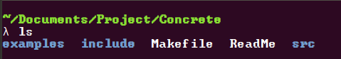
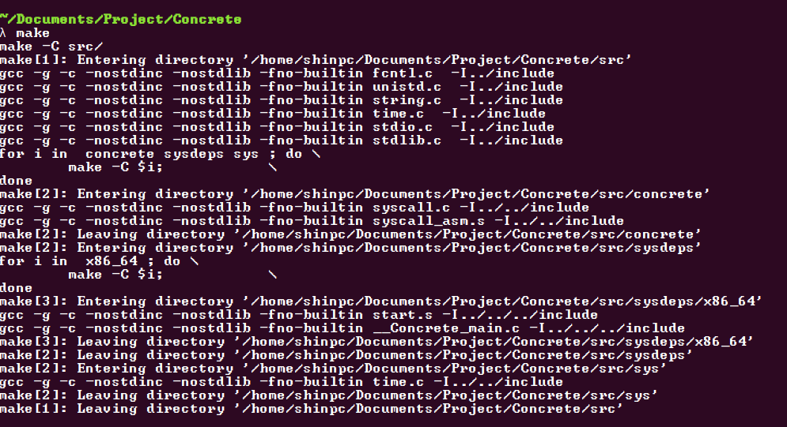
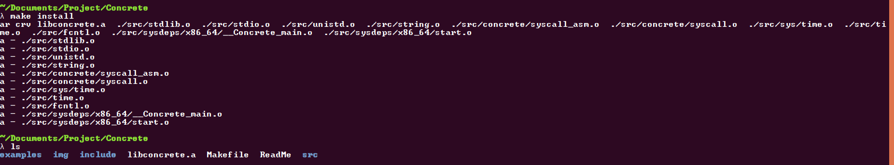

# Concrete

## 개요

이 프로젝트는 glibc, newlib, uClibc 등 다양한 C 표준 라이브러리의 작동 원리가 궁금하여, 직접 만들어보는 프로젝트입니다.
\
대부분의 소스는 직접 제작하였고, 메모리 할당과 같은 경우는 참고를 하여, 작업하고 있습니다.

## 요구 사항

### 운영체제
- Linux

### 프로그램
- GCC (9 +)
- GNU make

## 사용법

### 빌드

1. 우선 Makefile와 같은 폴더로 이동합니다.



2. 다음과 같은 명령어를 입력하시면 됩니다.

``` sh
$ make
$ make install
```

그럼 다음과 같이 빌드가 될 것 입니다.


3. 제대로 설치가 되었다면, 다음과 같은 라이브러리 파일이 나옵니다.



## 사용 언어
- C, ASM(Gnu Assembler for x86_64), Makefile

## 현재 개발 정도

### C 표준 라이브러리
- <assert.h\>      : X
- <complex.h\>     : **15%**
- <ctype.h\>       : X
- <errno.h\>       : X
- <fenv.h\>        : X
- <float.h\>       : X
- <inttypes.h\>    : **5%**
- <iso646.h\>      : **55%**
- <limits.h\>      : X
- <locale.h\>      : X
- <math.h\>        : X
- <setjmp.h\>      : X
- <signal.h\>      : X
- <stdalign.h\>    : **Complete**
- <stdarg.h\>      : **Complete (Only for GCC)**
- <stdatomic.h\>   : **35%**
- <stdbool.h\>     : **Complete**
- <stddef.h\>      : **Complete**
- <stdint.h\>      : **90%**
- <stdio.h\>       : **15%**
- <stdlib.h\>      : **10%(Warning: I don't recommend use mamory allocation)**
- <stdnoreturn.h\> : **Complete**
- <string.h\>      : **10%**
- <tgmath.h\>      : X
- <threads.h\>     : X
- <time.h\>        : **10%**
- <uchar.h\>       : X
- <wchar.h\>       : X
- <wctype.h\>      : X

### C POSIX 라이브러리
- <aio.h\> : X
- <arpa/inet.h\>   : X
- <cpio.h\> : X
- <dirent.h\> : X
- <dlfcn.h\> : X
- <fcntl.h\> : **10%**
- <fmtmsg.h\> : X
- <fnmatch.h\> : X
- <ftw.h\> : X
- <glob.h\> : X
- <grp.h\> : X
- <iconv.h\> : X
- <langinfo.h\> : X
- <libgen.h\> : X
- <limits.h\> : X
- <locale.h\> : X
- <monetary.h\> : X
- <mqueue.h\> : X
- <ndbm.h\> : X
- <net/if.h\> : X
- <netdb.h\> : X
- <netinet/in.h\> : **40%**
- <netinet/tcp.h\> : X
- <nl_types.h\> : X
- <poll.h\> : X
- <pthread.h\> : **0%**
- <pwd.h\> : X
- <regex.h\> : X
- <sched.h\> : X
- <search.h\> : X
- <semaphore.h\> : X
- <spawn.h\> : X
- <strings.h\> : X
- <stropts.h\> : X
- <sys/ipc.h\> : X
- <sys/nman.h\> : X
- <sys/msg.h\> : X
- <sys/resource.h\> : X
- <sys/select.h\> : X
- <sys/sem.h\> : X
- <sys/shm.h\> : X
- <sys/socket.h\> : **70%**
- <sys/stat.h\> : X
- <sys/statvfs.h\> : X
- <sys/time.h\> : **10%**
- <sys/times.h\> : X
- <sys/types.h\> : **10%**
- <sys/uio.h\> : **10%**
- <sys/un.h\> : X
- <sys/utsname.h\> : X
- <sys/wait.h\> : X
- <syslog.h\> : X
- <tar.h\> : **Complete**
- <termios.h\> : X
- <trace.h\> : X
- <ulimit.h\> : X
- <unistd.h\> : **10%**
- <utime.h\> : X
- <utmpx.h\> : X
- <wordexp.h\> : X

### Concrete 확장 라이브러리
- <concrete/macro.h\> : 개발에 필요한 매크로들 모음
- <concrete/types.h\> : stddef.h와 겹쳐 없어질 예정
- <concrete/syscall.h\> : 시스템 콜 구현 부분
- <concrete/read_line.h\> : passwd와 같이 내부 시스템 파일을 살펴봐야 하는 경우를 대비한 한줄 읽기 변수

## 주의 사항

**해당 프로젝트는 아직 공유 라이브러리로 제작되어있지 않으니, 주의해주세요**

## 버그 및 문의 사항
- [1729's email](mailto:shk052353@gmail.com)